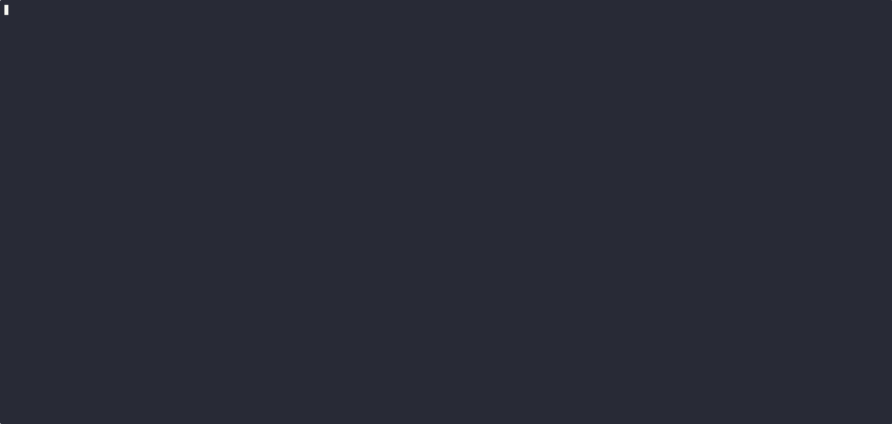

# Kessel Sabacc ♠️

> "Everything you've heard about me is true." — Lando Calrissian


<p align="center">
  
</p>

A fully playable terminal reproduction of **Kessel Sabacc**, the high-stakes card game from Star Wars lore — built in Rust with love, recklessness, and a little help from Claude Code.

## Features

- 🃏 Complete Kessel Sabacc rules — 44-card deck with Sand and Blood families
- 🎯 16 unique Shift Tokens adding deep strategic layers
- 🤖 ExpertBot with EV-optimised strategy (or Basic difficulty for a gentler game)
- 🌌 Immersive TUI — starfield menu, dice animations, round stats
- 📊 Game statistics with chip history chart
- ⚙️ Pure game engine — zero I/O, deterministic tests

## Quick Start

### Install from source

```bash
git clone https://github.com/AdrienGras/kessel-sabacc.git
cd kessel-sabacc
cargo run --release -p sabacc-cli
```

### CLI Options

```
Usage: sabacc-cli [OPTIONS]

Options:
  -q, --quick              Quick game (50 credits buy-in, 2 bots)
  -b, --bots <N>           Number of bot opponents (1-5) [default: 3]
  -B, --buy-in <AMOUNT>    Buy-in amount (50-200) [default: 100]
  -n, --name <NAME>        Your player name
  --no-tokens              Disable Shift Tokens
  -h, --help               Print help
```

## Rules

Kessel Sabacc is a game of nerve and numbers. Each player holds two cards — one Sand, one Blood — and tries to make them match or get as close to zero difference as possible. Bluff, draw, or play a Shift Token to tip the odds.

**→ [Full rules](RULES.md)**

## Architecture

```
kessel-sabacc/
├── crates/
│   ├── sabacc-core/     # Pure game logic — zero I/O, no side effects
│   ├── sabacc-cli/      # Terminal UI (Ratatui + Crossterm)
│   └── sabacc-wasm/     # WebAssembly bindings (planned)
└── web/                 # Svelte frontend (planned)
```

The core philosophy: **all game rules live in `sabacc-core`** as pure functions. No printing, no randomness leaks, no side effects. The frontends are just views.

## Roadmap

- [ ] Web frontend (WASM + Svelte)
- [ ] Online multiplayer
- [ ] More bot personalities
- [ ] Sound effects

## Contributing

Contributions are welcome! See [CONTRIBUTING.md](CONTRIBUTING.md) for guidelines.

## License

This project is licensed under the MIT License — see the [LICENSE](LICENSE) file for details.

## Credits

- **Star Wars** universe by Lucasfilm / Disney
- **Ratatui** — the excellent Rust TUI framework
- **Claude Code** by Anthropic — AI pair programming partner
- Built with ☕ and the Kessel Run spirit
